# PlayStudy — Product Guide

PlayStudy turns a learner's own material — pasted notes, links, PDFs — into
study sets, quizzes, and arcade games, then tracks real practice (time,
accuracy, streaks, scores) so the material sticks. **Pip**, the orange pup
mascot, fronts the brand.

This guide covers how the product flows on **web** and **mobile**, the
features behind each screen, and how the two clients stay in sync.

---

## The system at a glance

| Repo | What it is |
|---|---|
| `ps-bk-dj` | Django REST backend — the single source of truth for accounts, study sets, games, sessions, rewards, exam plans, and preferences. Also hosts the shared HTML5 game bundles (`games_host/`). |
| `PS-UI-WEB` | Next.js web client (this repo). Talks to Django through a BFF layer (httpOnly JWT cookies + CSRF). |
| `playstudy-mb-ui` | Flutter mobile client. Talks to the same Django API. |

Three things are deliberately **shared, not duplicated**:

1. **All data and logic** live in the backend — both clients read/write the
   same study sets, scores, rewards, exam plans, and preferences.
2. **Games are one implementation.** Each game is a single HTML5 canvas
   bundle in `ps-bk-dj/games_host/games/<slug>/<version>/`. The web embeds it
   in a sandboxed `<iframe>`; mobile loads the *same file* in a WebView. Both
   speak the same PlayStudy SDK (`playstudy-sdk.js`) contract:
   `init` (quiz/words payload in) → `score` / `reward` / `gameover` events out.
3. **Design tokens are one file.** `design-tokens.json` (brand purple
   `#6B5CE7`, Pip orange `#F7941D`, four flavor palettes, the full Pip
   mascot palette) generates the web CSS (`npm run gen:tokens`) and the
   Flutter constants (`dart run tool/gen_tokens.dart`).

---

## Web flow

### 1. Landing & sign-in

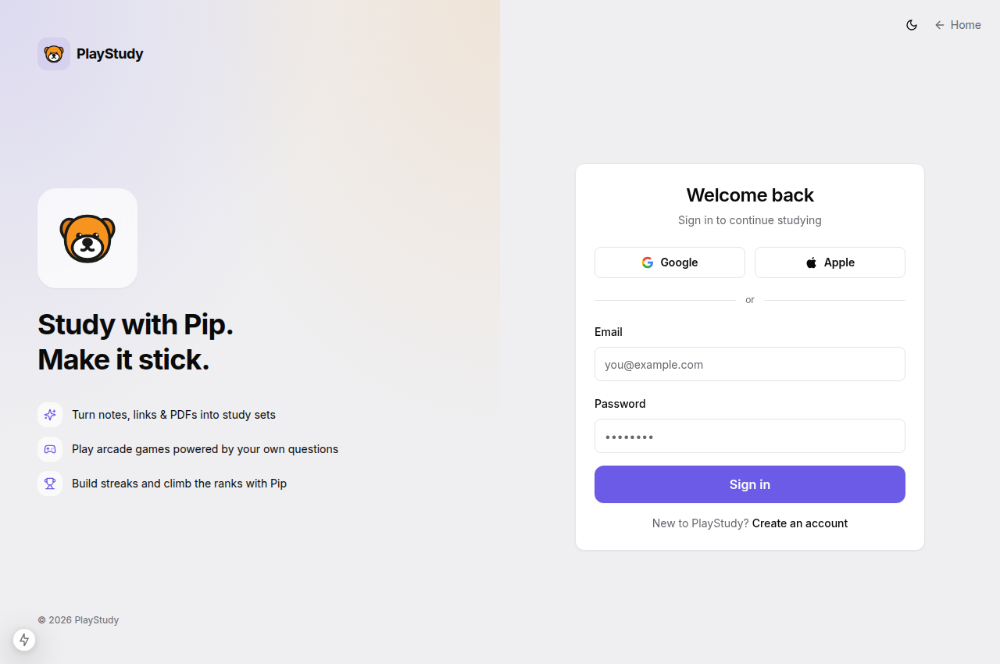

Email/password plus Google and Apple sign-in. Sessions are Django JWTs kept
in httpOnly cookies (`ps_access` / `ps_refresh`); every mutating call is
CSRF-protected (double-submit `ps_csrf` cookie + `x-csrf-token` header).
Demo accounts for development: `demo@playstudy.app` / `Playstudy123!`
(also `student@` and `parent@`).

### 2. Onboarding — pick your space

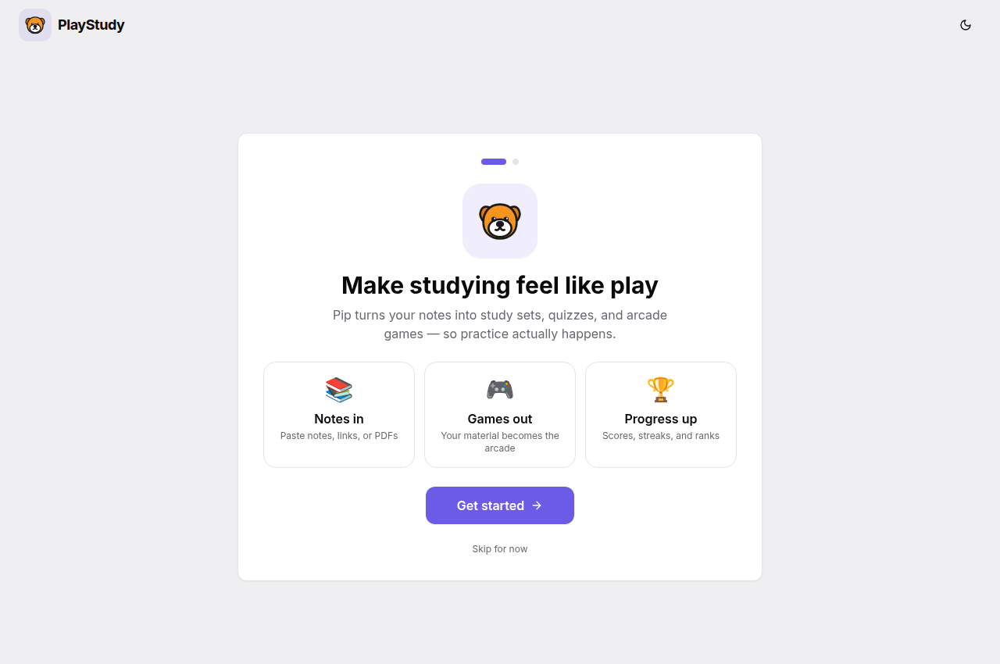

A three-step interactive questionnaire fronted by Pip: a welcome that shows
the value loop (notes in → games out → progress up), then a level pick with
large tactile cards that **live-preview the theme** as you choose, then (for
college) a Focus-vs-Rose vibe pick. Skippable at every step.

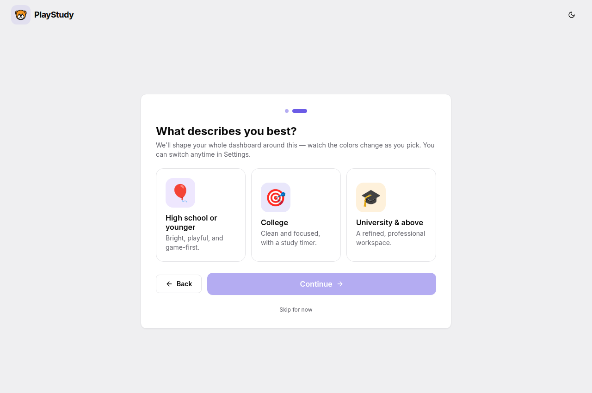

The answer maps to one of four dashboard **flavors** — the whole app
re-skins itself via CSS variables:

| Flavor | Audience | Character |
|---|---|---|
| `playful` | High school & younger | Vivid, rounder, game-first |
| `focus` | College (default) | Clean, stat-forward, study timer on top |
| `pro` | University & above | Deeper palette, tighter corners, professional |
| `rose` | College alternative | Focus layout in a pink palette |

The flavor is stored in a cookie for instant SSR and synced to the account
(see [Cross-device sync](#cross-device-sync)), so it follows the user to
mobile. It can be changed later in Settings.

### 3. Dashboard

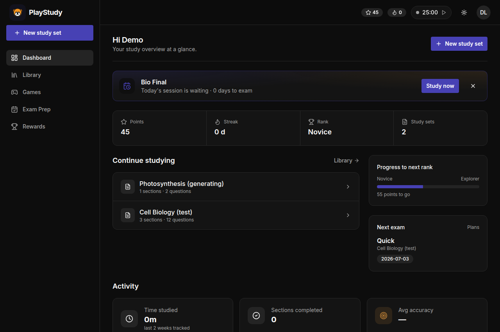

The flavor decides the layout. All variants share: points / streak / rank
stat tiles with a progress bar toward the next rank, an **activity overview**
(time studied, sections completed, average accuracy, daily activity chart —
fed by real reading heartbeats), a learning path of recent sets, and exam
reminders when a plan is active.

The **focus timer** lives in the topbar on every page (next to the theme
toggle). It is activity-aware, not a dumb clock: custom session length,
auto-pauses after ~6 minutes without interaction (with the reason shown),
resumes on scroll/click/keys, and suggests a break after 45 minutes of
sustained focus. Completed sessions earn points.

### 4. Library & creating study sets

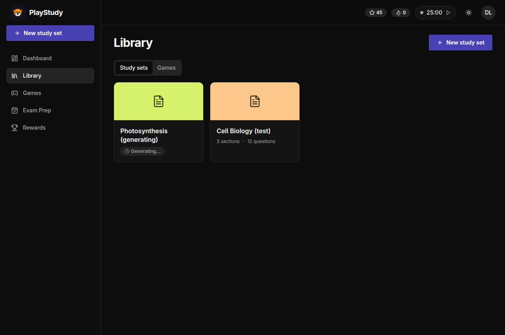

“New study set” accepts pasted notes, links, or uploads. Generation is
**progressive**: the set opens immediately and fills in live (sections and
questions appear as the backend streams them in), so interaction starts
right away instead of behind a spinner.

### 5. Study reader

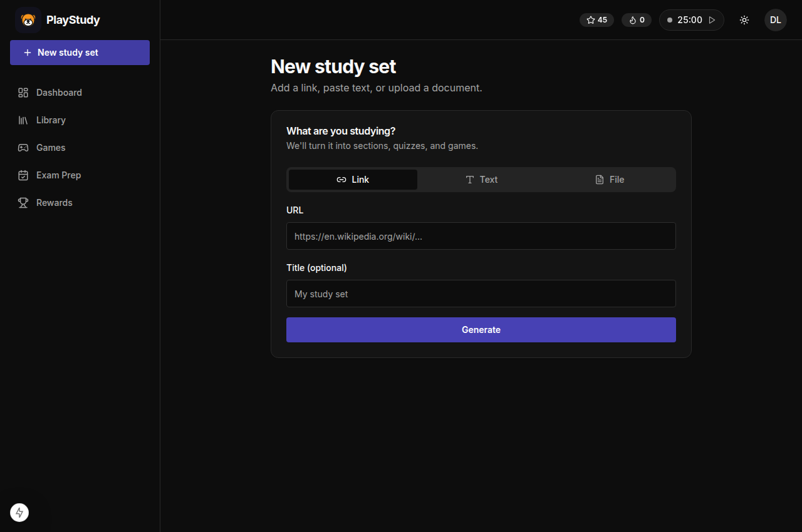

A wide, Notion-style reader: font/size controls, **user highlighting**
(select text → pick a color; hover a highlight to recolor or remove — stored
per section), per-section “Got it / Reviewed” tracking, a **Path** tab that
renders the set as a branching learning tree, and a Quiz tab. Active reading
time is heartbeated to the backend and feeds the dashboard analytics; wrong
quiz answers feed spaced repetition in exam plans.

### 6. Arcade — play your material

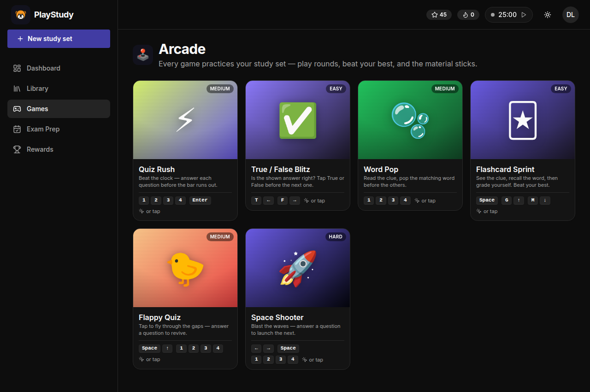

Every game pulls its questions/words from a study set (auto-picks your most
recent ready set, or launch with a specific one via “Play with this set”).
Tiles are big and playful: large game icon, difficulty badge, what the game
practices, your **best score**, and the exact key controls. All games are
also fully keyboard-playable.

| Game | Slug | Difficulty | Practice style |
|---|---|---|---|
| Quiz Rush | `quiz-rush` | medium | Timed multiple choice |
| True / False Blitz | `true-false` | easy | Rapid judgement |
| Word Pop | `word-pop` | medium | Clue → word recognition |
| Flashcard Sprint | `flashcard-sprint` | easy | Recall + self-grading |
| Flappy Pip | `flappy` | medium | Reflexes; crash → answer to revive |
| Space Shooter | `space-shooter` | hard | Waves; answer to launch the next |

### 7. The game session loop

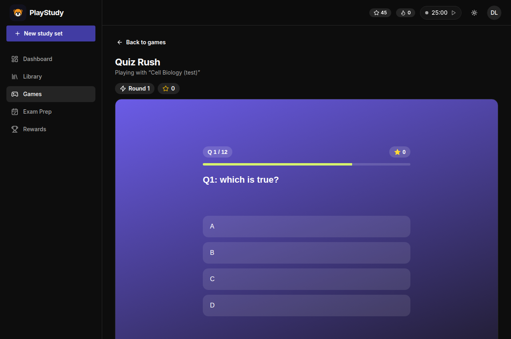

Playing is framed as **rounds against your personal best**. The session bar
shows the round number, the live score, your best for this game + set, and
how far you are from beating it. Score/reward/game-over events flow from the
bundle through the SDK to the host, which records a backend game session.

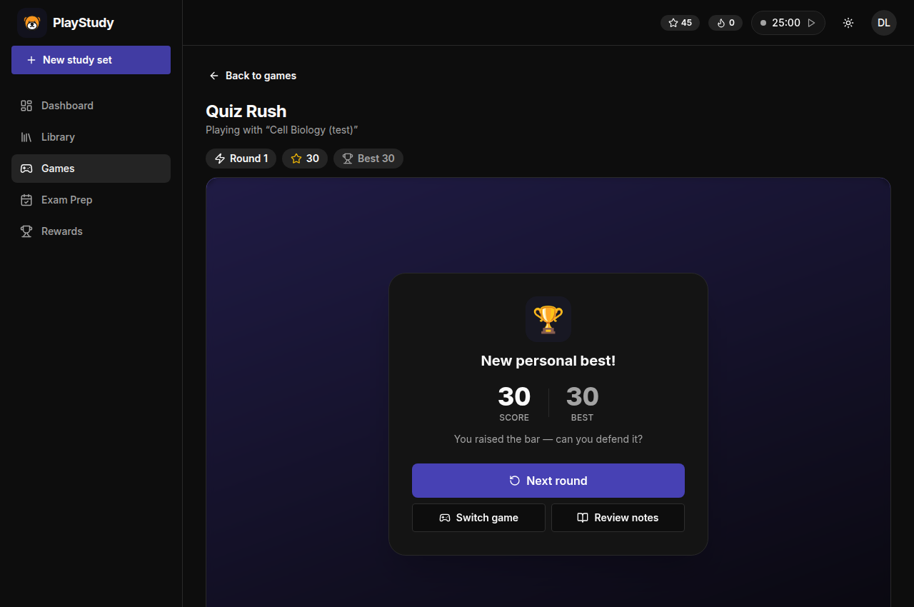

Game over is not a dead end: a **round summary** takes over the frame — big
score vs. best (with a “New personal best!” celebration when you top it) and
a clear progression: **Next round** (fresh run, new backend session, same
challenge target), **Switch game**, or **Review notes** (straight back to
the study set — closing the learn ↔ play loop).

### 8. Exam prep

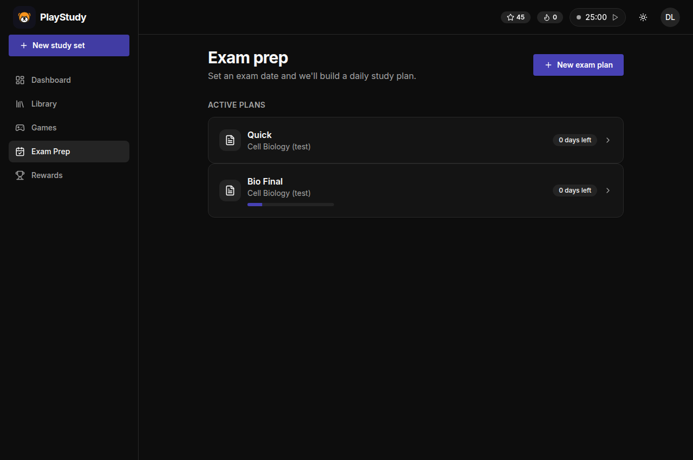

Create a plan with a deadline → the AI builds a day-by-day study guide →
**you approve it** → each day is “read a section, answer its questions.”
Wrong answers drop into a **spaced-repetition bucket** (Leitner boxes) and
resurface daily until answered correctly. Reminders appear on the dashboard;
frequency and excluded topics are adjustable in the plan's settings.

### 9. Rewards

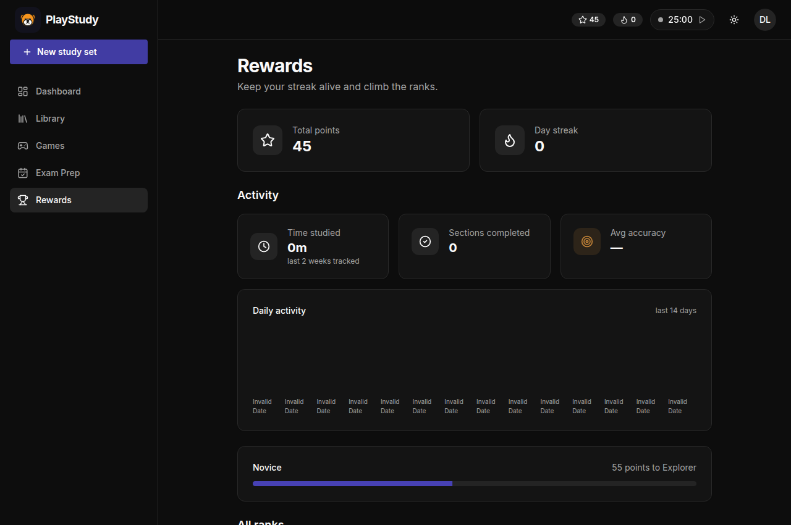

Points come from finishing quizzes, game checkpoints, study sessions, and
daily activity; they accumulate into streaks and ranks (Novice → Explorer →
…). The server computes and caps all point awards — clients only *report*
activity.

---

## Mobile flow

The Flutter app mirrors the same journey, adapted to touch:

1. **Sign in / sign up** against the same accounts and JWT auth.
2. **Home** with the learner's sets, points, streaks, and rank — the same
   rewards state the web shows.
3. **Create a study set** from notes/links/PDFs; the same progressive
   generation fills content in as it lands.
4. **Read & quiz**: section-by-section reading with progress reporting and
   quizzes; completions and accuracy flow into the same analytics.
5. **Games**: the same arcade. Native Flutter games (Guess the Word, Super
   Dash, Crossword) plus the shared HTML5 bundles (Flappy Pip, Space
   Shooter/Hunter) hosted in a WebView through the identical SDK bridge —
   scores and rewards report through the same endpoints. Bundles are cached
   on-device for offline play.
6. **Exam prep**: the same plans, daily sessions, and spaced-repetition
   review against the same API.

> Mobile screenshots require a device/emulator build (Flutter isn't run in
> this environment); the flows above map 1:1 to the web sections.

## Cross-device sync

Anything a learner does on one client is visible on the other because the
backend owns all state. Three sync layers:

| Layer | Mechanism |
|---|---|
| Account & content | Same API: study sets, quiz results, game sessions, exam plans, rewards. |
| Preferences | `User.preferences` (JSON field) merged via `PATCH me/` — theme, flavor, reading font/size follow the user across devices. |
| Study analytics | Reading heartbeats + section completions + game sessions are recorded server-side and power both dashboards. |

Personal-best game scores are intentionally device-local (a personal
challenge target, not account state).

## Running locally

```bash
./dev.sh
```

One command from `PS-UI-WEB/`: sets up the Python venv, migrates, seeds demo
users + games, starts Django on :8000 and Next.js on :3000 with dev
auto-login. `DEV_AUTOLOGIN=0 ./dev.sh` to use the login screen.

---

*Screenshots in this doc are captured from the running app in
`docs/screenshots/` — regenerate them after UI changes so the doc stays
truthful.*
